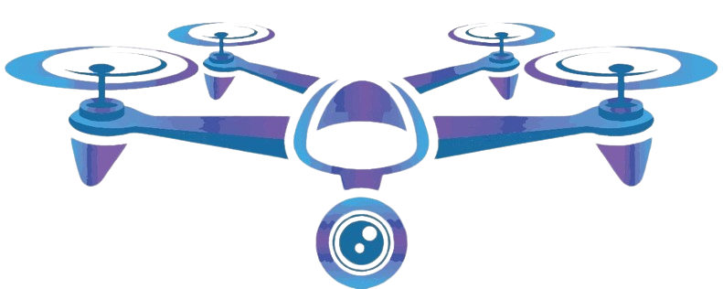
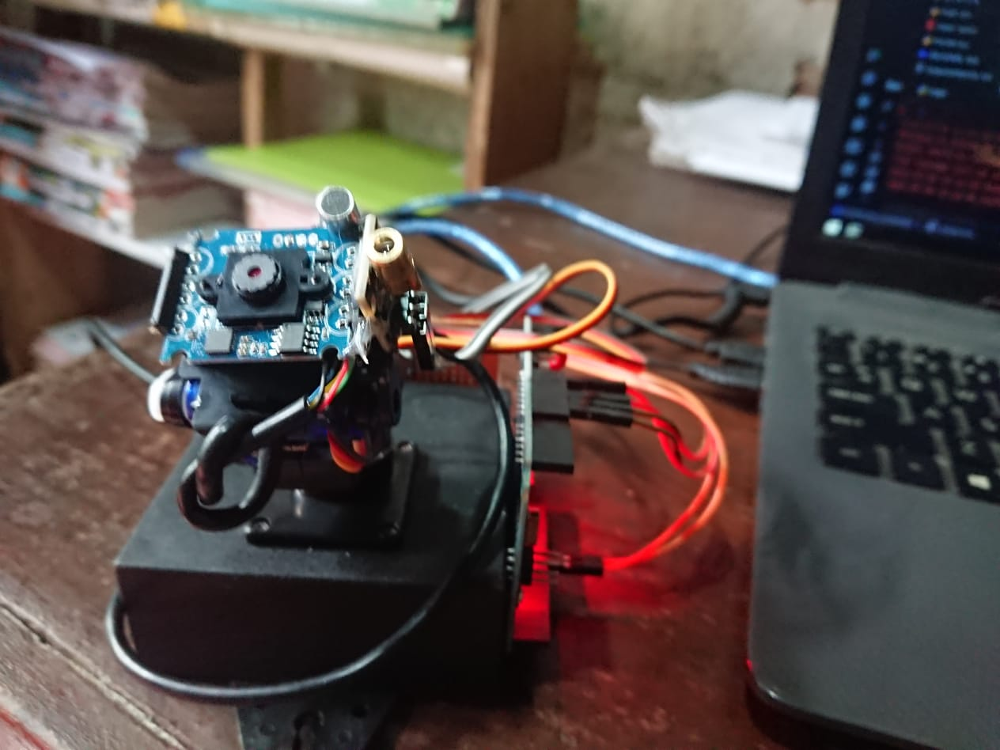
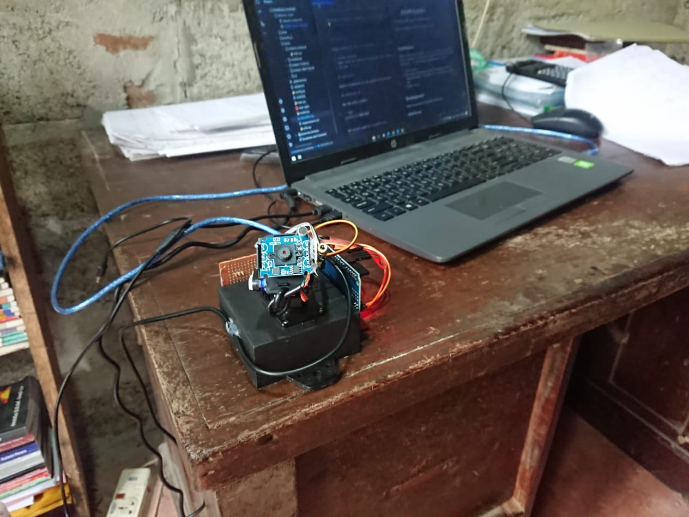
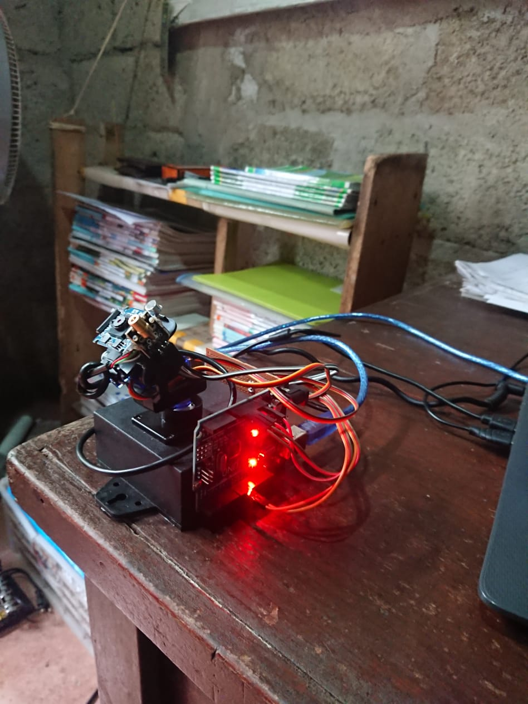
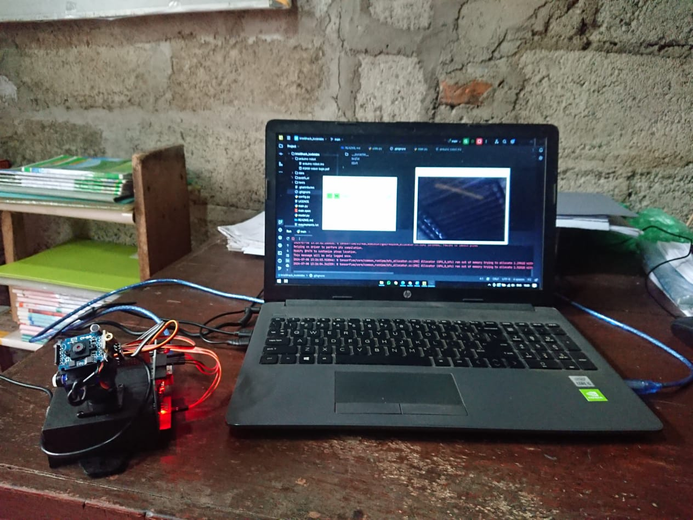

#  ASAM System
___*AI Security CaMera System*_ - _*KodeLabs product.*___

Civilian and Military surveillance and protection system.

### Images Gallery

<div style="display: flex; flex-wrap: wrap; gap: 10px;">
  
  
  
  
  
  
</div>

## Installation

Highly advised to set up a separate `anaconda` environment to run, develop or test the application. If you only need to use the prebuild app. use one of the binary files in `/bin` folder. (Select the appropriate one for your os.)

1. Install Anaconda
2. Open using the anaconda environment you created and install all the required files listed in `/requirements.txt` (use only the one in project root).
3. Run the `main.py`

### Working output


## Development

Highly recommended to use pycharm and anaconda.

### Build the exe 

Run the below command

```bash
pyinstaller main.spec
```

### Convert pyqt5-ui to python file

Run the below command

```bash
pyuic5 -o pyqt5_ui/main_window.py pyqt5_ui/main_window.ui
pyuic5 -o pyqt5_ui/splash_widget.py pyqt5_ui/splash_widget.ui
pyuic5 -o pyqt5_ui/video_widget.py pyqt5_ui/video_widget.ui
pyuic5 -o pyqt5_ui/chat_widget.py pyqt5_ui/chat_widget.ui
```

### Update app settings

Update variable values in the `config.py`.

### Calculation of angle of rotation in `xyz` plane

Refer the [ASAM-robot-logic.pdf](/arduino-robot/ASAM-robot-logic.pdf) to understand the underling mathematical calculation.

### Arduino Code

Refer the [Arduino Code](/arduino-robot/arduino-robot.ino) to refer teh arduino program.

